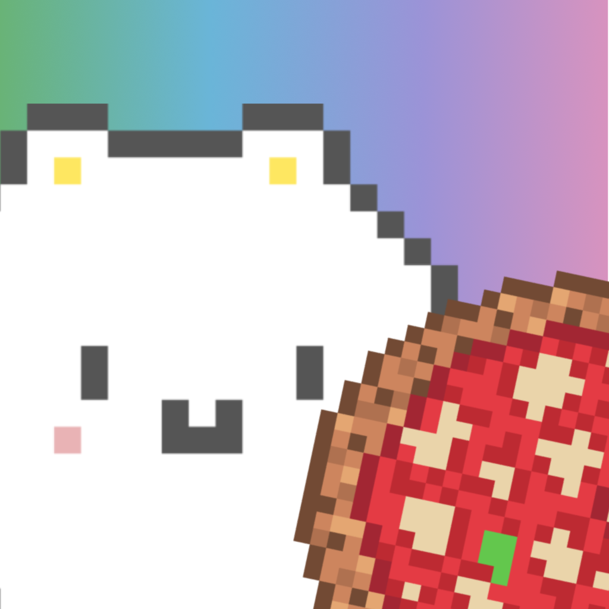

# WWDC22GumiEats
WWDC22 Swift Student Challenge Winning project. Small Tamagotchi-like game in SwiftUI and SpriteKit

* Frameworks: SpriteKit, SwiftUI, GameplayKit, AVFoundation.

GumiEats! Pizza Edition is an Arcade Game that revolves around little creatures called Gumi that like to eat...A lot! Pizza is their favorite food, so help them gather the right ingredients to cook it as they want!
The full game is intended to be as a home for your new virtual pet(s) with different minigames! Works on iPhone and Ipad.

 
 
 
 

## Gallery

